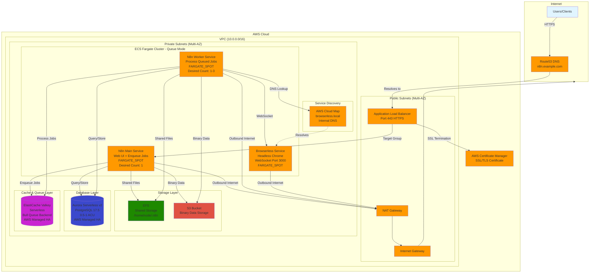
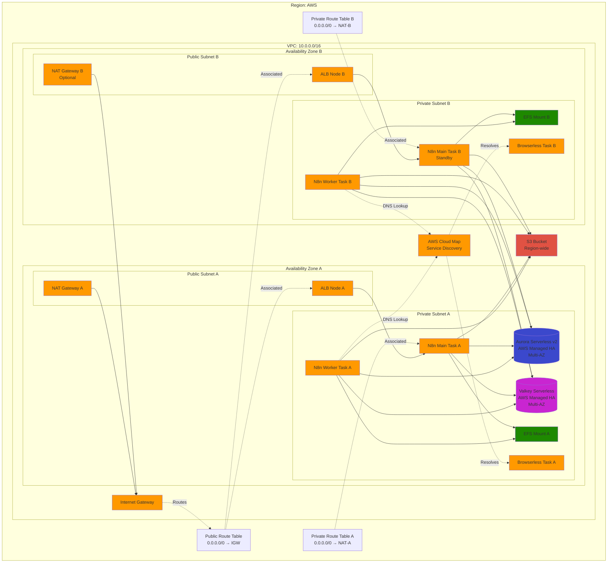
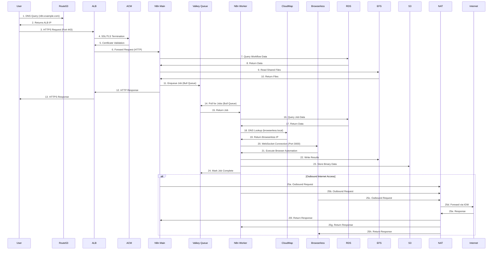
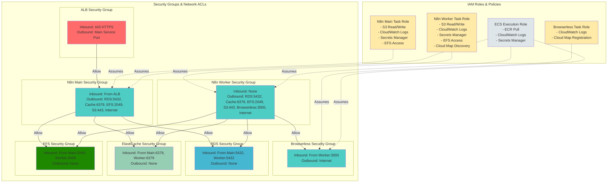
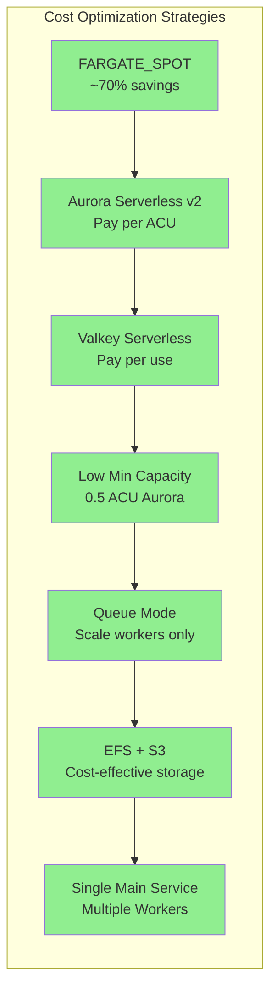
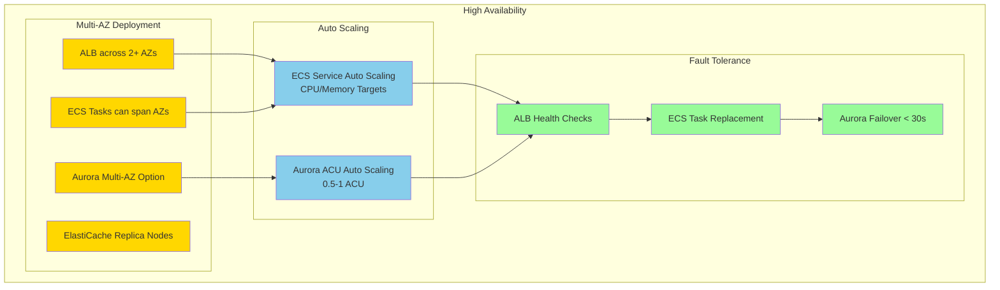

# AWS N8n Architecture Diagrams

Based on the Terragrunt configuration in `prod/terragrunt/new-vpc/terragrunt.hcl`

## 1. High-Level Architecture Overview

## 2. Detailed Network Architecture

## 3. Data Flow Diagram - Queue Mode

## 4. Security Architecture

## 5. Component Details

### VPC Configuration
- **CIDR Block**: 10.0.0.0/16
- **Public Subnets**: Multi-AZ deployment with Internet Gateway
- **Private Subnets**: Multi-AZ deployment with NAT Gateway
- **DNS**: Enabled
- **DNS Hostnames**: Enabled

### N8n Queue Mode Services
#### N8n Main Service
- **Container Image**: n8nio/n8n:latest
- **Purpose**: Web UI, workflow management, job enqueuing
- **Capacity Provider**: FARGATE_SPOT (cost-optimized)
- **Desired Count**: 1 task
- **Environment**: EXECUTIONS_MODE=queue, QUEUE_BULL_REDIS_HOST, N8N_BINARY_DATA_MODE=filesystem
- **Health Check**: Via ALB target group

#### N8n Worker Service
- **Container Image**: n8nio/n8n:latest
- **Purpose**: Process queued jobs, execute workflows
- **Capacity Provider**: FARGATE_SPOT (cost-optimized)
- **Desired Count**: 1-3 tasks (auto-scaling based on queue depth)
- **Environment**: EXECUTIONS_MODE=queue, N8N_BINARY_DATA_MODE=filesystem
- **Health Check**: Queue polling health

#### Browserless Service
- **Container Image**: browserless/chrome:latest
- **Purpose**: Headless Chromium for web automation
- **Port**: 3000 (WebSocket)
- **Service Discovery**: AWS Cloud Map (browserless.local)
- **Capacity Provider**: FARGATE_SPOT
- **Desired Count**: 1 task

### Application Load Balancer
- **Scheme**: Internet-facing
- **Listeners**: HTTPS (Port 443)
- **SSL/TLS**: ACM Certificate
- **Target Group**: N8n Main Service only
- **Health Checks**: HTTP/HTTPS endpoint

### Aurora Serverless v2
- **Engine**: PostgreSQL 17.5
- **Capacity**: Min 0.5 ACU, Max 1 ACU
- **High Availability**: AWS-managed Multi-AZ (single serverless resource)
- **Backup**: Automated daily backups
- **Encryption**: At rest and in transit
- **Purpose**: Workflow definitions, execution history, credentials

### ElastiCache Valkey Serverless
- **Engine**: Valkey (Redis-compatible)
- **Type**: Serverless (auto-scaling)
- **High Availability**: AWS-managed Multi-AZ (single serverless resource)
- **Purpose**: Bull Queue backend for job queue management
- **Encryption**: In transit and at rest

### EFS (Elastic File System)
- **Purpose**: Shared storage for workflow files
- **Mount Path**: /home/node/.n8n
- **Access**: Mounted to both Main and Worker services
- **Encryption**: At rest and in transit

### S3 Bucket
- **Purpose**: Binary data storage for large workflow artifacts
- **Access**: N8n Main and Worker services
- **Encryption**: Server-side encryption (SSE-S3)
- **Lifecycle**: Optional policies for cost optimization

### AWS Cloud Map
- **Purpose**: Service discovery for internal DNS
- **Namespace**: browserless.local
- **Target**: Browserless service IP addresses
- **Access**: N8n Worker service for WebSocket connections

### Route53 & ACM (Optional)
- **DNS**: Custom domain (n8n.example.com)
- **Certificate**: ACM SSL/TLS certificate
- **Auto-renewal**: Managed by AWS

### NAT Gateway
- **Purpose**: Outbound internet access for private subnets
- **Deployment**: Per availability zone
- **Elastic IP**: Attached for static public IP

## 6. Cost Optimization Features

## 7. High Availability & Scaling

## Key Observations

1. **Fully Serverless Architecture**: Uses FARGATE_SPOT, Aurora Serverless v2, and managed services
2. **Cost-Optimized**: Minimal resources with SPOT instances and low ACU settings
3. **Scalable**: Can scale ECS tasks and Aurora ACUs based on demand
4. **Secure**: Private subnets for compute and data layers, with ALB in public subnet
5. **Resilient**: Multi-AZ deployment with automatic failover capabilities
6. **Production-Ready**: Includes SSL/TLS, custom domain support, and monitoring

## Infrastructure Components Summary

| Component | Type | Purpose | High Availability |
|-----------|------|---------|-------------------|
| VPC | Network | Isolated network environment | Regional |
| Public Subnets | Network | Host ALB and NAT Gateway | Multi-AZ |
| Private Subnets | Network | Host ECS, RDS, ElastiCache | Multi-AZ |
| Internet Gateway | Network | Internet access for public subnets | Highly available |
| NAT Gateway | Network | Outbound internet for private subnets | Per AZ |
| Application Load Balancer | Compute | Traffic distribution and SSL termination | Multi-AZ |
| ECS Fargate | Compute | N8n container orchestration | Multi-AZ |
| Aurora Serverless v2 | Database | PostgreSQL database | Multi-AZ optional |
| ElastiCache Valkey | Cache | Redis-compatible caching | Multi-AZ optional |
| Route53 | DNS | Domain name resolution | Global |
| ACM | Security | SSL/TLS certificates | Regional |
| Security Groups | Security | Firewall rules | Regional |
| IAM Roles | Security | Access control | Global |

## Deployment Characteristics

- **Infrastructure as Code**: Terragrunt + Terraform
- **Provisioning Time**: ~15-20 minutes
- **Estimated Monthly Cost**: $50-150 (varies by usage)
- **Maintenance**: Fully managed services, minimal operational overhead
- **Monitoring**: CloudWatch integration for logs and metrics
