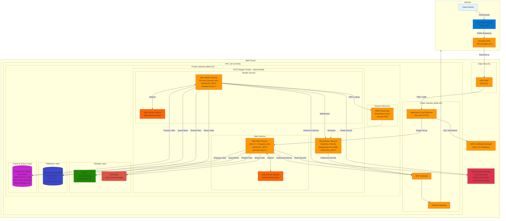
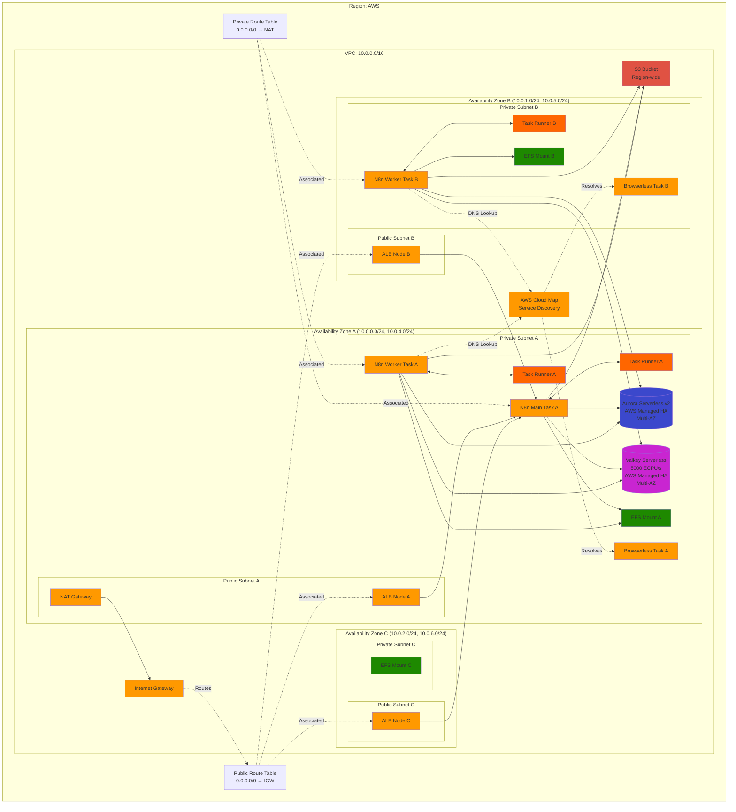
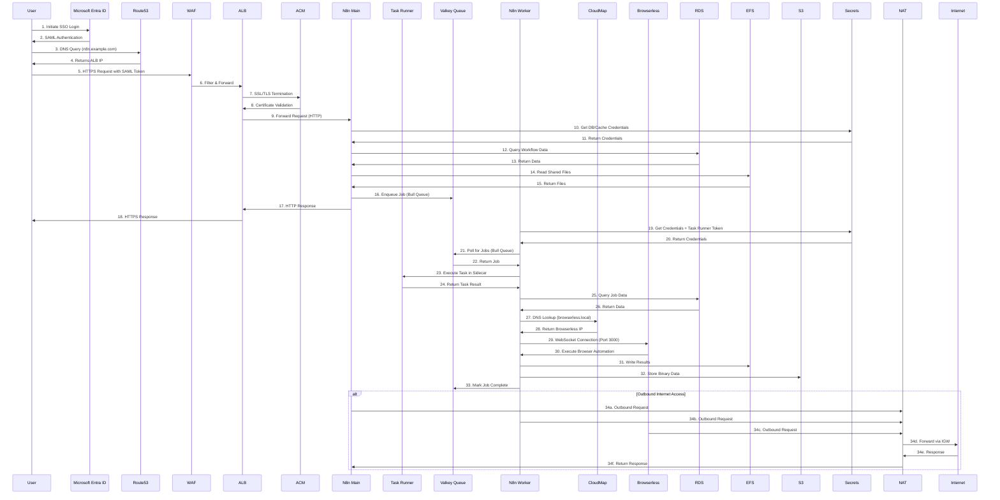
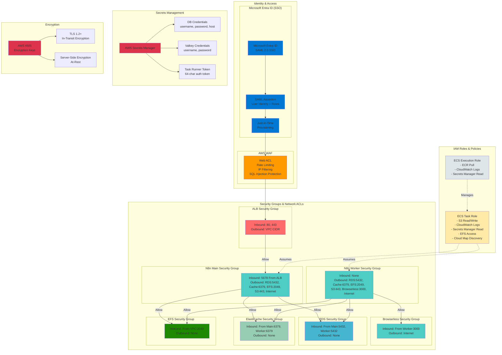
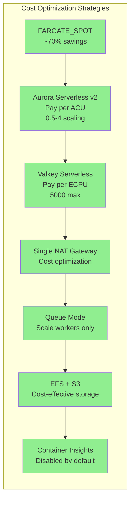
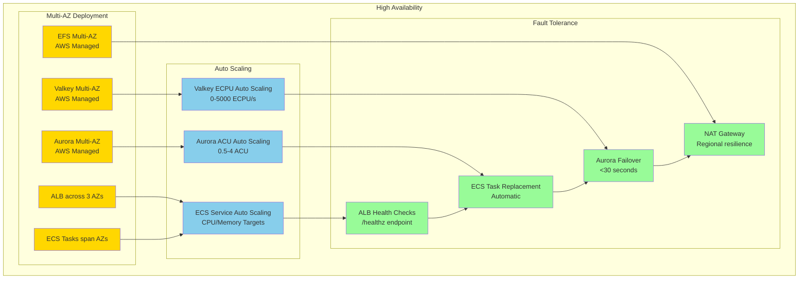

# AWS N8n Architecture Diagrams

Based on the Terragrunt configuration in `stg/terragrunt/new-vpc/terragrunt.hcl` and `prod/terragrunt/new-vpc/terragrunt.hcl`

## 1. High-Level Architecture Overview

## 2. Detailed Network Architecture

## 3. Data Flow Diagram - Queue Mode with Microsoft Entra ID SSO

## 4. Security Architecture with Microsoft Entra ID

## 5. Component Details

### Microsoft Entra ID Integration
- **Protocol**: SAML 2.0 Single Sign-On
- **Just-in-Time Provisioning**: Automatic user creation on first login
- **Role Mapping**: Instance roles provisioned from Entra ID claims
- **Session Management**: Configurable via N8N_SSO_* environment variables

### VPC Configuration
- **CIDR Block**: 10.0.0.0/16
- **Public Subnets**: 10.0.4.0/24, 10.0.5.0/24, 10.0.6.0/24 (Multi-AZ)
- **Private Subnets**: 10.0.0.0/24, 10.0.1.0/24, 10.0.2.0/24 (Multi-AZ)
- **NAT Gateway**: Single gateway for cost optimization
- **DNS**: Enabled
- **DNS Hostnames**: Enabled

### N8n Queue Mode Services

#### N8n Main Service
- **Container Image**: n8nio/n8n:latest
- **Task Runner Sidecar**: n8nio/runners:latest
- **Purpose**: Web UI, workflow management, job enqueuing
- **Capacity Provider**: FARGATE_SPOT (cost-optimized)
- **Desired Count**: 1 task
- **CPU/Memory**: 1024 CPU, 2048 MB (+ Task Runner resources if enabled)
- **Environment**: EXECUTIONS_MODE=queue, N8N_RUNNERS_ENABLED=true
- **Health Check**: Via ALB target group (/healthz)

#### N8n Worker Service
- **Container Image**: n8nio/n8n:latest
- **Task Runner Sidecar**: n8nio/runners:latest
- **Purpose**: Process queued jobs, execute workflows
- **Capacity Provider**: FARGATE_SPOT (cost-optimized)
- **Desired Count**: 2 tasks (configurable)
- **CPU/Memory**: 1024 CPU, 2048 MB (+ Task Runner resources)
- **Concurrency**: 20 concurrent executions per worker
- **Pool Size**: 20 DB connections per worker

#### Task Runner (n8n v2.0+)
- **Container Image**: n8nio/runners:latest
- **Purpose**: Isolated execution environment for workflow tasks
- **Mode**: External (sidecar container)
- **Auto Shutdown**: 15 seconds timeout
- **Authentication**: 64-character token via Secrets Manager

#### Browserless Service
- **Container Image**: browserless/chrome:latest
- **Purpose**: Headless Chromium for web automation
- **Port**: 3000 (WebSocket)
- **Service Discovery**: AWS Cloud Map (browserless.local)
- **Capacity Provider**: FARGATE_SPOT
- **Desired Count**: 1 task

### Application Load Balancer
- **Scheme**: Internet-facing
- **Listeners**: HTTP (80) redirects to HTTPS (443)
- **SSL/TLS**: ACM Certificate (TLS 1.2+)
- **Target Group**: N8n Main Service only
- **Health Checks**: /healthz endpoint
- **Idle Timeout**: 300 seconds
- **Stickiness**: Enabled (3600s cookie duration)

### AWS WAF (Optional)
- **Purpose**: Edge protection
- **Features**: Rate limiting, IP filtering, SQL injection protection
- **Integration**: Associated with ALB via web ACL ARN

### Aurora Serverless v2
- **Engine**: PostgreSQL 17.7
- **Capacity**: Min 0.5 ACU, Max 4 ACU
- **High Availability**: AWS-managed Multi-AZ
- **Backup**: Automated daily backups
- **Encryption**: At rest (KMS) and in transit (SSL)
- **Purpose**: Workflow definitions, execution history, credentials
- **Connection Pool**: Main (10), Worker (20)

### ElastiCache Valkey Serverless
- **Engine**: Valkey 8 (Redis-compatible)
- **Type**: Serverless (auto-scaling)
- **Capacity**: 5000 ECPU/s max, 1 GB storage
- **High Availability**: AWS-managed Multi-AZ
- **Purpose**: Bull Queue backend for job queue management
- **Encryption**: In transit (TLS) and at rest
- **Authentication**: User/password via Secrets Manager

### EFS (Elastic File System)
- **Purpose**: Shared storage for workflow files
- **Mount Path**: /home/node/.n8n
- **Access**: Mounted to both Main and Worker services
- **Encryption**: At rest and in transit
- **Access Point**: UID/GID 1000, permissions 777

### S3 Bucket
- **Purpose**: Binary data storage for large workflow artifacts
- **Access**: N8n Main and Worker services via IAM role
- **Encryption**: Server-side encryption (AES-256)
- **Versioning**: Enabled
- **Lifecycle**: 30-day noncurrent version expiration

### AWS Secrets Manager
- **Secrets**:
  - DB Credentials (username, password, host, port, dbname)
  - Valkey Credentials (username, password)
  - Task Runner Auth Token (64-char token)
- **Recovery Window**: Configurable (default 7 days)

### AWS Cloud Map
- **Purpose**: Service discovery for internal DNS
- **Namespace**: {prefix}.local
- **Target**: Browserless service IP addresses
- **Access**: N8n Worker service for WebSocket connections

### Route53 & ACM (Optional)
- **DNS**: Custom domain (e.g., n8n.example.com)
- **Certificate**: ACM SSL/TLS certificate
- **Auto-renewal**: Managed by AWS

### CloudWatch Logs
- **Log Groups**:
  - {prefix}-logs (Main service, 180 days)
  - {prefix}-worker-logs (Worker service, 180 days)
  - {prefix}-task-runner-main-logs (Task Runner, 180 days)
  - {prefix}-task-runner-worker-logs (Task Runner, 180 days)
  - {prefix}-browserless-logs (Browserless, 180 days)
  - /aws/elasticache/{prefix}-valkey (Valkey, 180 days)

## 6. Cost Optimization Features

## 7. High Availability & Scaling

## Key Observations

1. **Microsoft Entra ID SSO**: SAML 2.0 authentication with Just-in-Time provisioning
2. **Fully Serverless Architecture**: Uses FARGATE_SPOT, Aurora Serverless v2, Valkey Serverless
3. **Task Runner Support**: External task runners for isolated workflow execution (n8n v2.0+)
4. **Cost-Optimized**: Minimal resources with SPOT instances, low ACU settings, single NAT
5. **Scalable**: Can scale ECS tasks, Aurora ACUs, and Valkey ECPUs based on demand
6. **Secure**: AWS WAF, private subnets, encrypted secrets, TLS everywhere
7. **Resilient**: Multi-AZ deployment with automatic failover capabilities
8. **Production-Ready**: SSL/TLS, custom domain support, comprehensive monitoring

## Infrastructure Components Summary

| Component | Type | Purpose | High Availability |
|-----------|------|---------|-------------------|
| Microsoft Entra ID | Identity | SAML 2.0 SSO | Global |
| AWS WAF | Security | Edge protection | Regional |
| VPC | Network | Isolated network environment | Regional |
| Public Subnets | Network | Host ALB and NAT Gateway | Multi-AZ (3) |
| Private Subnets | Network | Host ECS, RDS, ElastiCache | Multi-AZ (3) |
| Internet Gateway | Network | Internet access for public subnets | Highly available |
| NAT Gateway | Network | Outbound internet for private subnets | Single (cost opt) |
| Application Load Balancer | Compute | Traffic distribution and SSL termination | Multi-AZ |
| ECS Fargate | Compute | N8n container orchestration | Multi-AZ |
| Task Runner | Compute | Isolated workflow execution | Per task |
| Aurora Serverless v2 | Database | PostgreSQL database | Multi-AZ (AWS managed) |
| ElastiCache Valkey | Cache | Redis-compatible queue backend | Multi-AZ (AWS managed) |
| EFS | Storage | Shared file storage | Multi-AZ (AWS managed) |
| S3 | Storage | Binary data storage | Regional |
| Route53 | DNS | Domain name resolution | Global |
| ACM | Security | SSL/TLS certificates | Regional |
| Secrets Manager | Security | Credential management | Regional |
| CloudWatch | Monitoring | Logs and metrics | Regional |
| Security Groups | Security | Firewall rules | Regional |
| IAM Roles | Security | Access control | Global |

## Deployment Characteristics

- **Infrastructure as Code**: Terragrunt + Terraform
- **Provisioning Time**: ~15-20 minutes
- **Estimated Monthly Cost**: $50-200 (varies by usage)
- **Maintenance**: Fully managed services, minimal operational overhead
- **Monitoring**: CloudWatch integration for logs and metrics (180 days retention)
- **n8n Version**: v2.0+ required for Task Runner support
